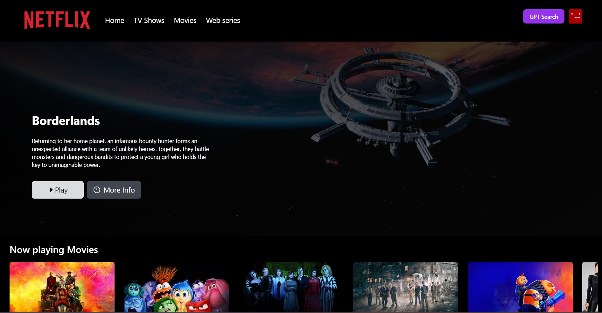

# Netflix GPT &nbsp;&nbsp;&nbsp;&nbsp;[Live link](https://netflix-gpt.deepanshu-sahu-projects.live/)



Movies recomandation with AI.

## Description

Netflix GPT is a web application that allows users to browse movies, view recommendations, and get personalized movie suggestions using AI. This project integrates with movie databases and uses AI to enhance the user experience by providing relevant movie suggestions.

The application is built with React and Tailwind CSS for a smooth and responsive user interface, and it utilizes AI to generate personalized movie recommendations.

## Features

### Home Page (Unauthenticated Users)
- **Sign In / Sign Up:** 
  - Users can sign in or create an account using the SignInForm or SignUpForm.

### Browse Page
- **Navbar:** 
  - Includes search functionality, profile, and navigation options.
- **Showcase:** 
  - Highlights trending and popular movies.
- **Trending Movies:** 
  - Displays a list of trending movies fetched in real-time.
- **Movies Suggestions:** 
  - AI-powered suggestions based on user preferences and viewing history.
  
### Netflix GPT
- **Search:** 
  - Users can search for any movie using the search bar.
- **Movies Suggestions:** 
  - Displays personalized recommendations powered by AI based on search results.

## Upcoming Features

- **User Watchlist:**
  - Enable users to create and manage a watchlist for movies they plan to watch in the future.

- **Dark Mode / Light Mode:**
  - Allow users to switch between dark mode and light mode for a better viewing experience.

- **Movie Trailers and Previews:**
  - Add the option to preview trailers before watching the full movie.

## Technologies Used

- React
- Tailwind CSS
- React Router
- **YouTube API:** Used for embedding movie trailers and video content.
- **ChatGPT API:** An API provided by OpenAI for integrating conversational AI into the application, enabling advanced movie recommendations and interactions.
- **The Movie Database (TMDb) API**: For providing comprehensive movie data, including details, images, and recommendations.

## Getting Started

### Prerequisites

Before running the project, ensure you have the following installed:

- **Node.js (v12 or higher):**
  - A JavaScript runtime for building and running the application.

- **npm (v6 or higher) or yarn (v1.22 or higher):**
  - Package managers used for managing project dependencies.

### Installation

1. **Clone the repository:**

    ```bash
    git clone https://github.com/dee077/netflix-gpt.git
    cd netflix-gpt
    ```

2. **Install Dependencies:**

    Using npm:

    ```bash
    npm install
    ```

3. **Set Up Environment Variables:**

    Create a `.env` file in the root directory and add your environment variables. You’ll need to include:

    ```env
    REACT_APP_CHATGPT_API_KEY = your-value 
    REACT_APP_YOUTUBE_API_KEY=your-youtube-api-key = your-value
    REACT_APP_THEMOVIEDB_BEARER_TOKEN = your-value 
    REACT_APP_OPENAI_API_KEY = your-value
    REACT_APP_FIREBASE_APIKEY = your-value
    REACT_APP_FIREBASE_AUTHDOMAIN = your-value
    REACT_APP_FIREBASE_PROJECTID = your-value
    REACT_APP_FIREBASE_STORAGEBUCKET = your-value
    REACT_APP_FIREBASE_MESSAGINGSENDERID = your-value
    REACT_APP_FIREBASE_APPID = your-value
    REACT_APP_FIREBASE_MEASUREMENTID = your-value
    ```

4. **Run the Application:**

    Using npm:

    ```bash
    npm start
    ```

    The application will be available at `http://localhost:3000`.

# Contributing

If you would like to contribute to this project, please feel free to fork the repository, create a new branch, and submit a pull request with your changes. Contributions are always welcome!

  
